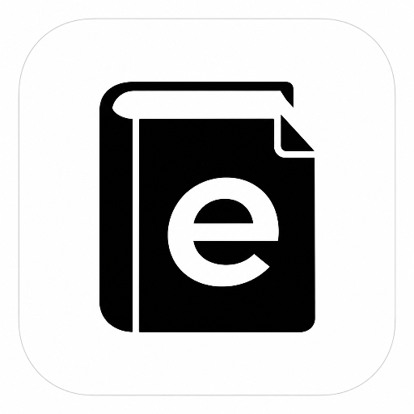
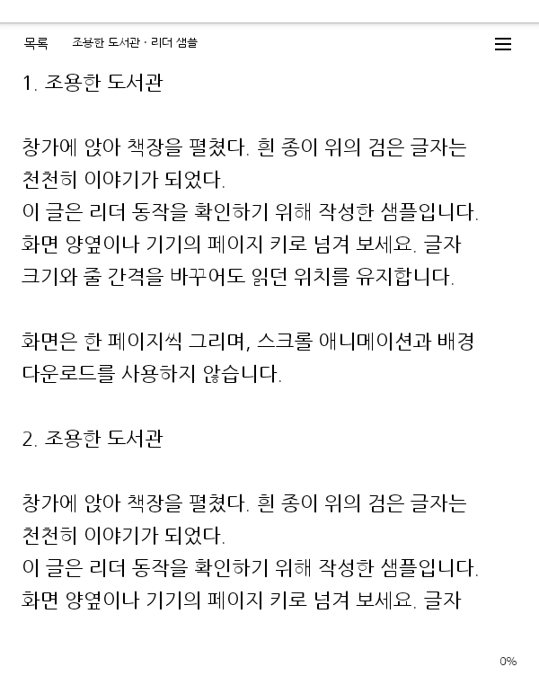
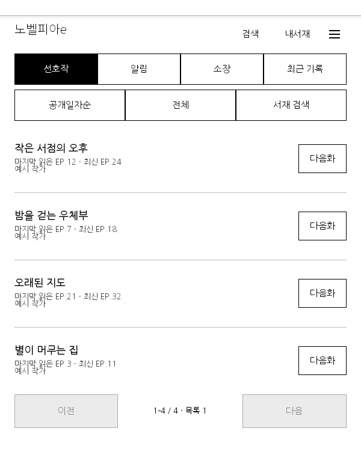
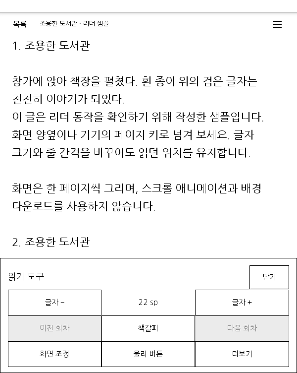
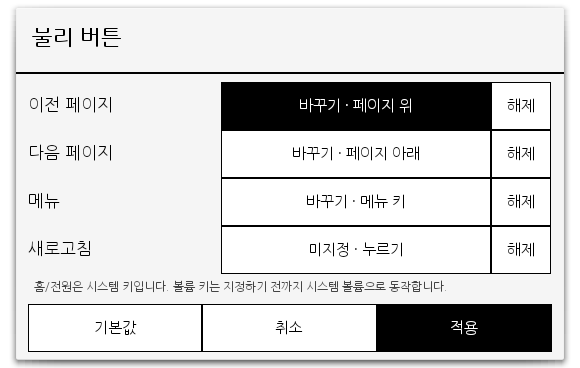

  

# 노벨피아e

전자잉크 리더에서 노벨피아를 읽기 위해 만든 비공식 Android 앱입니다. 크레마 카르타 G처럼 Android 4.4를 사용하는 기기를 염두에 두고 만들었습니다.

작품 목록과 본문을 한 화면씩 넘기고, 물리 버튼으로 페이지를 이동할 수 있습니다. 읽는 동안에는 본문과 진행률을 보여주며, 가운데를 누르면 읽기 도구가 열립니다.

**[APK 내려받기](https://github.com/hegelty/novelpia-e/releases/latest)** · [설치 방법](#설치하기) · [지원 범위](#지원하는-기능)

## 전자잉크에서 읽기 편하도록

- **목록도 한 화면씩 넘깁니다.** 서재, 작품 목록, 회차 목록을 계속 스크롤하지 않아도 됩니다.
- **흰 바탕과 검은 글자를 기본으로 사용합니다.** 화면 전환 애니메이션을 없애고, 버튼과 구분선을 단순하게 만들었습니다.
- **물리 버튼에 네 가지 동작을 지정할 수 있습니다.** 이전 페이지, 다음 페이지, 메뉴, 새로고침 중에서 고릅니다. 기기에서 보내는 버튼 입력을 직접 등록할 수도 있습니다.
- **읽다가 글자 크기와 줄 간격을 바꿀 수 있습니다.** 설정 도구를 열어도 본문 위치는 그대로 유지됩니다. 진행률은 퍼센트로 표시합니다.
- **명도·대비·채도를 조절할 수 있습니다.** 앱 화면에 적용되는 설정이며, 기기의 조명 밝기를 바꾸는 기능은 아닙니다.
- **불러오는 동안 화면이 밀리지 않습니다.** 하단 상태 메시지가 나타나도 목록과 페이지 이동 버튼의 자리를 유지합니다.

기기 제조사의 전용 잔상 제거 기능이나 EPD 갱신 방식을 제어하지는 않습니다. 배터리 사용량과 잔상은 기기마다 달라질 수 있으며, 별도의 실기기 측정 결과는 없습니다.

## 화면 살펴보기

아래 이미지는 Android 4.4.2 AVD에서 **실제로 실행한 앱을 캡처한 화면**입니다. 공개용 캡처에는 직접 작성한 샘플 본문과 가상의 서재 데이터를 사용했습니다. 실제 계정의 서재나 소설 본문은 싣지 않았습니다.

| 본문 읽기 | 서재 |
|:---:|:---:|
|  |  |
| 양옆을 누르면 페이지가 바뀝니다. | 읽었던 회차와 최신 회차를 함께 확인합니다. |

| 읽기 도구 | 물리 버튼 설정 |
|:---:|:---:|
|  |  |
| 가운데를 눌러 도구를 열고 닫습니다. | 기기의 버튼을 눌러 동작을 직접 지정합니다. |

## 지원하는 기능

| 기능 | 사용할 수 있는 내용 |
|---|---|
| 작품 찾기 | 작품명 검색, 노벨피아 작품·회차 주소 열기 |
| 내서재 | 선호작·알림·소장·최근 기록, 정렬, 기존 그룹 선택, 서재 검색. 최근 기록은 최근 본 순으로 고정되며 정렬·그룹 변경은 지원하지 않습니다. |
| 이어 읽기 | 읽던 위치 저장, 이어보기·다음화 버튼, 읽기 전 목록으로 돌아가기 |
| 최신 회차 | 사이트에서 확인한 실제 `EP.` 번호를 표시합니다. 확인하지 못한 경우에는 등록 편수만 표시합니다. |
| 로그인 | 이메일 로그인, 선택적인 비밀번호 저장과 자동 로그인. 비로그인 상태로 앱을 시작하면 로그인 창이 열립니다. |
| 성인 모드 | 켜기·끄기, 모드가 꺼져 열람이 막힐 때 안내 및 다시 열기. 로그인이나 본인인증이 필요하면 별도로 안내합니다. |
| 책갈피와 TXT | 주소 책갈피, 기기에서 고른 UTF-8 TXT 파일 읽기 |
| 화면과 버튼 | 글자 크기·줄 간격, 명도·대비·채도, 물리 버튼 지정 |

비밀번호 저장과 자동 로그인은 기본적으로 꺼져 있습니다. 저장을 선택하면 비밀번호를 기기에서 암호화해 보관합니다. 쿠키와 소설 본문은 파일로 저장하지 않습니다.

### 아직 지원하지 않거나 확인하지 못한 부분

- 앱 안에서 결제하거나 이용권을 구매할 수 없습니다. 작품 열람에는 노벨피아 계정의 권한이 그대로 적용됩니다.
- 이미지로 된 회차·만화, 작품 일괄 다운로드, 오프라인 서재는 지원하지 않습니다.
- 선호작 추가·삭제, 그룹 생성·이동, 최근 기록 삭제는 지원하지 않습니다.
- 기기 안에서 구글 등 SNS 계정으로 로그인하는 기능은 없습니다. [PC 로그인 가져오기](docs/GOOGLE_LOGIN.md)는 실험적 기능이며, 실제 전송 성공을 확인하지 못했습니다.
- 유료·PLUS 회차 전반, 크레마 실기기의 버튼과 잔상, 가로 화면은 추가 확인이 필요합니다. 현재 공개 버전은 API 19 AVD와 실제 계정의 일부 동작을 기준으로 검증했습니다.

## 설치하기

1. [최신 릴리즈](https://github.com/hegelty/novelpia-e/releases/latest)에서 `novelpia-e-0.1.0.apk`를 받습니다.
2. APK를 기기로 옮겨 파일 관리자에서 엽니다. 기기에서 요구하면 알 수 없는 출처의 앱 설치를 허용합니다.
3. 앱을 열어 로그인합니다. 로그인하지 않고 살펴보려면 창을 닫고 **메뉴 → 파일과 책갈피 → 리더 미리보기**를 선택합니다.

**Android 4.4 이상**이 필요합니다. 루팅이나 시스템 인증서 변경은 필요하지 않습니다. 기기 화면 크기와 버튼 구성에 따라 배치와 동작이 달라질 수 있습니다.

성인 모드는 **메뉴 → 계정과 도움말 → 성인 모드**, 버튼 설정은 **메뉴 → 물리 버튼**에서 바꿀 수 있습니다.

## 문제가 생겼을 때

[이슈](https://github.com/hegelty/novelpia-e/issues)에 기기 이름, Android 버전, 문제가 생긴 순서와 오류 문구를 적어주세요. 작품과 회차의 공개 주소가 있으면 함께 알려주세요. 비밀번호, 쿠키, 세션 파일은 첨부하지 마세요.

사이트의 화면이나 응답 형식이 바뀌면 일부 기능이 작동하지 않을 수 있습니다. 개인 프로젝트이므로 수정 일정이나 지원 지속을 약속하지 않습니다.

## 비공식 프로젝트 및 면책 안내

노벨피아e는 **노벨피아와 관련 없는 개인 프로젝트**입니다. 노벨피아의 공식 앱이나 제휴 서비스가 아니며, 노벨피아의 승인·후원·지원을 받지 않습니다. 노벨피아의 이름과 서비스, 작품에 대한 권리는 각 권리자에게 있습니다.

이 소프트웨어는 **있는 그대로(AS IS)** 제공됩니다. 법이 허용하는 범위에서 상품성, 특정 목적에 대한 적합성, 서비스 연동이나 지속적인 작동을 포함한 어떠한 보증도 하지 않습니다. 사용 또는 사용 불능으로 발생하는 손해에 대해 저작권자와 기여자는 책임을 지지 않습니다. 구체적인 무보증 및 책임 제한 조건은 아래 라이선스를 따릅니다.

## 라이선스

이 프로젝트의 소스 코드는 **GNU GPL v3**로 배포합니다. [라이선스 전문](LICENSE)과 Conscrypt/BoringSSL에 대한 [추가 허가](LICENSE-EXCEPTION)를 함께 확인해주세요. 포함된 라이브러리와 글꼴은 각각의 라이선스를 따릅니다. [외부 구성요소와 고지](docs/THIRD_PARTY.md)에 출처와 조건을 정리했습니다.

직접 빌드하거나 수정하려면 [개발 안내](docs/BUILD.md)를 참고하세요. [검증 기록](docs/VALIDATION.md)과 [아이콘 제작 기록](docs/branding/README.md)도 공개합니다.
